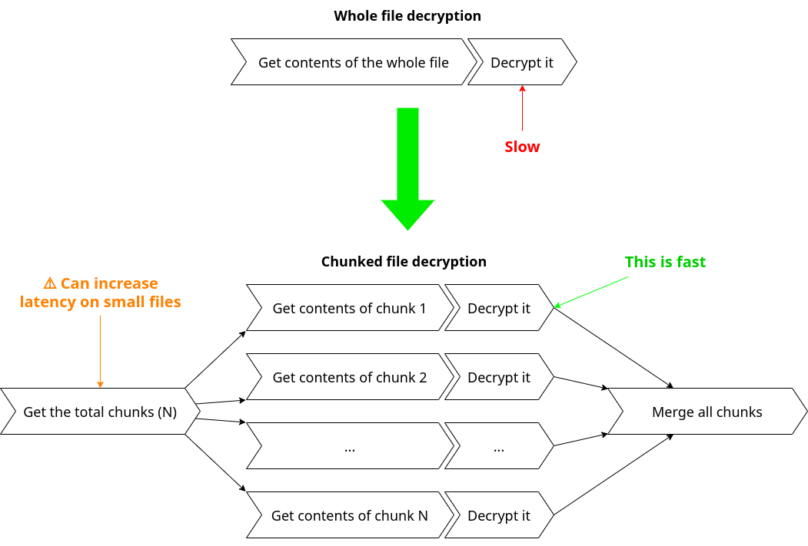
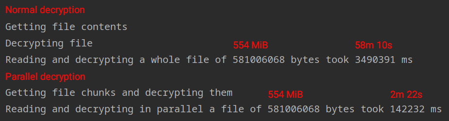

Read and decrypt large files in parallel to speed up the process.

# Introduction

Decrypting large files with a slow algorithm can quickly become a headache, especially when what you have to decrypt is
a critical part of your application.

That's what I wanted to solve here. What if we could do that decryption in parallel, using multiple threads?

Turns out it isn't hard. To do it, we need to split large files into smaller chunks. That way, we read all the small
chunks
in [parallel](https://github.com/matias-pg/parallel-decryption/blob/master/src/main/java/dev/matiaspg/paralleldecryption/service/ChunkedFileService.java#L57)
, decrypt them (also in parallel) and then merge them.

# The results

To test the results, I used
a [CSV](https://github.com/matias-pg/parallel-decryption/tree/master/src/main/resources/stories.csv) containing
3,460,954 stories from Hacker News (the file weights 554 MiB). You can generate a similar CSV
with [this script](https://gist.github.com/matias-pg/041af42b10a6c520843c0cb356f98732).

The project is using Base64 encoding to simulate encryption and decryption, and
a [delay](https://github.com/matias-pg/parallel-decryption/blob/master/src/main/java/dev/matiaspg/paralleldecryption/encryption/DummyDecryptor.java#L19)
was added to simulate a slow algorithm.

Anyway, here are the results:

As you can see, the decryption time went from **58 minutes and 10 seconds** to **2 minutes and 22 seconds**!
Now, the results in the real world may vary, since the decryption algorithm you use may not be as slow (and remember,
the encryption is artificially slow to simulate some real-world implementations). But the main point is: if you've got
big headaches, parallelism may help you (?)